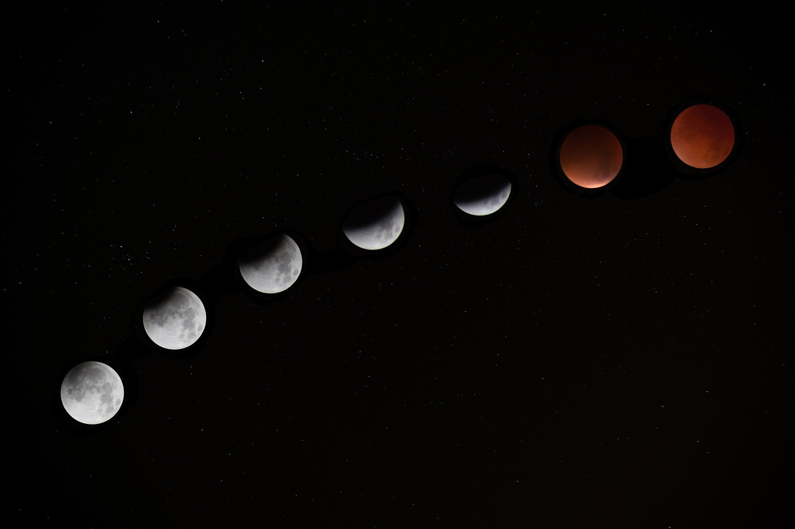
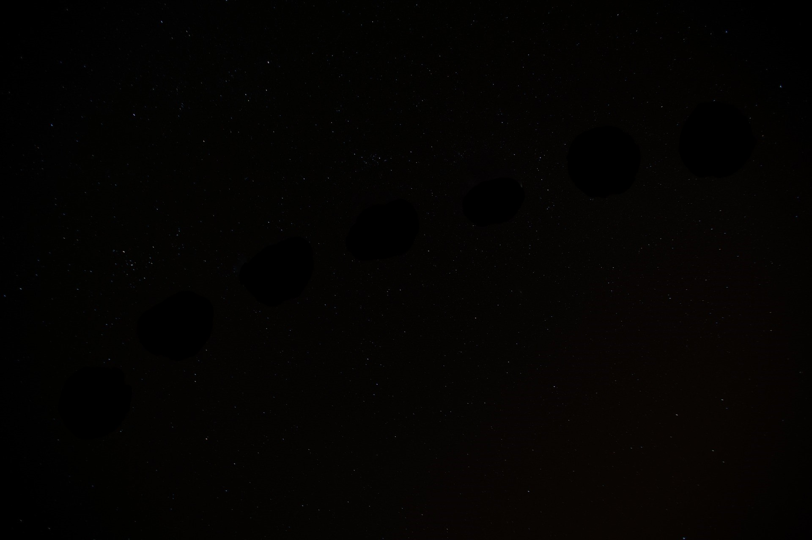

# Action-Shot-Image-Processor-
Enggen 131 Project

**Instructions:** Ensure Matlab R2017b or later is installed, download all files and follow instructions in ImageCombiner.m

Action Shot:

Action Shot Removed:

